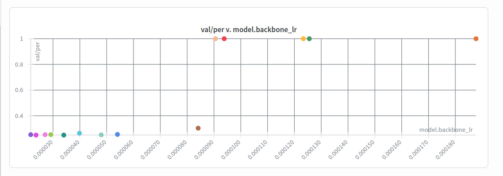

# Speech Phonetic Track — Team Epoch

Competition solution for the [DrivenData Speech Phonetic Transcription Challenge](https://www.drivendata.org/competitions/309/childrens-phonetic-asr/leaderboard) hosted by the [Gates Foundation](www.gatesfoundation.org), achieving **second place** with a phoneme error rate (PER) of **0.2607** on the private leaderboard.

## Approach

Our pipeline consists of three stages:

### 1. CTC Models (5 architecture families)

We train multiple CTC-based speech recognition models that predict IPA phoneme sequences from audio:

| Architecture | Backbone | # Models | Individual MBR-50 PER |
|---|---|---|---|
| **WavLM-large** | `microsoft/wavlm-large` | 6 | 0.236 — 0.239 |
| **Whisper-large** | `openai/whisper-large-v3` | 3 | 0.246 — 0.247 |
| **Whisper-medium** | `openai/whisper-medium` | 2 | 0.253 — 0.255 |
| **HuBERT-large** | `facebook/hubert-large-ll60k` | 2 | 0.247 — 0.248 |

All models use a 2-layer CTC head on top of frozen-then-finetuned SSL/Whisper encoder features, with EMA weight averaging. Training uses SpecAugment, waveform augmentation (time stretch, pitch shift, band-stop filter), and duration-based batch sampling of 30 seconds. Preprocessing only consisted out of converting all audio samples to 16k and mono. The main hyperparameters were swept over with a wandb or smac3 sweep. Number of epoch ranged from 12-20 depending on overfit speed/risk

They were trained on a train/val split of 80/20, grouped on `child_id`. This correlated pretty well with LB scores, with the r2-correlation being around 0.95 for all our submissions. A full 5-fold CV wasnt done due to excesive runtime. 

Two of the WavLM-large models are trained on all available data (no validation holdout) for the final submission. 

### 2. MBR Decoding (per model)

Instead of greedy or standard beam search decoding, we use **Minimum Bayes Risk (MBR) decoding** with beam width 50:

1. Generate 50 hypotheses via CTC beam search (pyctcdecode)
2. Compute pairwise edit distances between all hypotheses (after IPA normalization)
3. Select the hypothesis with minimum expected character error rate under the approximate posterior

MBR consistently improves over greedy by 0.001–0.003 PER per model.

### 3. Character-Level ROVER Ensemble

We combine all 13 MBR-decoded predictions using a character-level ROVER (Recognizer Output Voting Error Reduction) algorithm:

1. **Backbone selection**: pick the medoid hypothesis (minimum total edit distance to all others)
2. **Independent alignment**: align each other hypothesis to the backbone via edit distance
3. **Weighted voting**: at each character position, vote with optional per-model weights
4. **Insertion handling**: include inserted characters only if strict majority votes for them

Architecture diversity is the single biggest lever; adding whisper and HuBERT models to a WavLM-only ensemble reduced PER from 0.2364 to 0.2259.

# Setup

1. Install the prerequisities
     - Python version 3.11
     - UV astral

2. Install the required python packages in the pyproject.toml file using uv sync.

3. Put all the drivendata + talkbank under the data/audio folder, and the jsonl files under the data/, named ``train_phon_transcripts.jsonl`` and ``train_phon_transcripts_talkback.jsonl`` respectively.

# Hardware

The solution were run on different workstations with the following specs with a range of the following specs:
- CPU: Ryzen 9 7950x, Threadripper pro 3945WX, Threadripper pro 5955WX, Threadripper pro 7965WX
- RAM: 96 - 128 GB DDR4/5
- GPU: Quadro RTX 6000 24gb, RTX A5000 24gb, RTX A6000 48gb

A GPU with at least 24gb VRAM and at least 32gb RAM is needed for training.

Training time ranged from 5 hours for the whisper-medium on the best GPU to 12 hours for the Wavlm-large on the worst GPU, provided the data is preprocessed to .npy files.

Inference time: The ensemble of 13 models just fitted in the 2 hour inference time limit. Each model itself took around 9 minutes to make predictions on the test set. 

## Project Structure

```
speech_phonetic_track/
├── configs/                     # Hydra configuration
│   ├── default.yaml             # Base config
│   ├── experiments/             # Per-run configs (copied from .hydra/)
│   ├── model/                   # Model architecture configs
│   ├── augmentation/            # Augmentation configs
│   ├── decoder/                 # Decoder configs (greedy, beam, MBR)
│   ├── final_submission/        # The 13 configs of the models trained for the final submission.
│   └── ...
|   data/
|   ├── audio/
|   ├── noise/
├── src/
│   ├── preprocessing/
│   │   ├── dataset.py           # Wav2Vec2Dataset, WhisperDataset, data loaders
│   │   ├── phoneme_tokenizer.py # IPA character-level tokenizer (54 tokens)
│   │   ├── augmenations.py      # Waveform augmentation pipeline
│   │   └── ...
│   ├── train/
│   │   └── train_CTC.py         # Training loop with EMA, SpecAugment, early stopping
│   ├── utils/
│   │   ├── models.py            # WhisperCTC, Wav2Vec2CTC model classes
│   │   ├── decoder.py           # GreedyDecoder, BeamSearchDecoder, MBRDecoder
│   │   ├── score.py             # IPA-CER scoring with normalize_ipa()
│   │   └── ...
│   ├── optimize_decoder/
│   │   ├── rover.py             # ROVER ensemble strategies
│   │   ├── ensemble_experiments.py  # Weighting & ablation experiments
│   │   ├── error_breakdown.py   # S/D/I error analysis
│   │   └── ...
│   ├── vowel_rescoring/         # XGBoost phoneme pair rescoring (experimental)
│   ├── eval.py                  # Standalone evaluation with optional logit saving
│   └── mbr_eval.py              # MBR decoding + parquet saving for all runs
├── run_inference.py             # Competition inference: MBR + ROVER ensemble
├── pack_submission.sh           # Pack submission zip
└── pyproject.toml
```

## Key Results

### Progression of improvements

<!--Maybe do LB score instead, also missing pretty mcuh everything -->

| Stage | Val PER | Public LB PER | Technique |
|---|---|---|---|
| Best single model (greedy) | 0.2376 | 0.2766 | WavLM-large CTC |
| + MBR-50 decoding | 0.2363 | | Beam search + MBR selection |
| + 5-model ROVER (WavLM only) | 0.2364 | | Character-level voting |
| + 8-model diverse ROVER | 0.2284 | 0.2613 | Added whisper + HuBERT |
| + 9-model ROVER | 0.2265 | | Added whisper-medium |
| + 13-model ROVER | 0.2259 | 0.2599 | 6 WavLM + 3 whisp-L + 2 whisp-M + 2 HuBERT |

### What didn't work

| Technique | Result | Why |
|---|---|---|
| XGBoost vowel rescoring | Overfits to specific model | CTC logit features don't transfer across models |
| Fine-tuning decoder parameters | -0.0004 at best, overfit risk | Shallow optimum, tuned on val |
| Post-processing rules (ː fixes, impossible bigrams) | Negligible | Too rare (~175 tokens in 30k utterances) |
| Logit-level ensemble (averaging logits) | +0.1 PER (much worse) | Calibration mismatch across models |
| TTA (speed perturbation) | Worse than ensembeling independent models | Shallow diversity vs real model diversity |
| Weighted ROVER | +0.0002 at best | With balanced architecture representation, equal weights are near-optimal |
| KenLM | -0.04 local, no difference LB | Likely overfitting on local data, due to corpus made on local data |

### Other things we tried
We tried a lot of different things too, but did not have conclusive proof if they worked or not. Here is a list of these ideas:

- **External datasets**: These included pretraining on non-banned external datasets, which failed due to lack of decent quality data. 

- **SSL pretraining**: We tried to integrate the data from the word track into our pipeline in two different approaches. The first one was to try and use reconstruction-SSL on this to already pretune the wavlm's and hubert's to children speech. This seemed to not matter much, but needs more extensive testing. 

- **Multi Task Learning**: We also tried to use the word data with a MTL task; by creating a 2nd CTC head for the word labels, and using alternating batches to get an even split. While this seemed to have potential, we left it due to lack of time. 

- **More robust preprocessing**: We looked at various preprocessing approaches, like denoising and audio segmentation, but no fast and reliable enough pipeline was found before the end of the comptition.  


### Other quirks
We found that fp16 had significant better performance than bf16, up to a **performance boost of 0.03** running the same config on both fp16 and bf16. Due to us limiting the max_grad to under 10, we did not have any stability issues with an autocaster + fp16, so it turned to our default.

The 'phoneme' we predicted worst was the length-mark (ː), and then the glottal-stop (ʔ), with our models almost never predicting these. This would make sense as oppsed to other phonemes, these two dont make a unique and consistent noise. We tried various things in post-processing to reconstruct these, but no solution worked.

We did encounter some stability issues with the model collapsing to only predicting blanks at some point in the training loop and thus being stuck at a per of 1.0 for both train and val. We figured this was due to a slightly too high learning rate for the backbone:



Exactly why this happens still isnt fully clear to us.
## Usage

### Training

```bash
# Standard training with default config (wavlm-base-plus)
uv run src/run_pipeline.py 

# Train one of final models
uv run src/run_pipeline.py --config-dir configs/final_submission --config-name wavlmLarge1
# Where the config name is one of hubertLarge, wavlmAlldata, wavlmLarge, whisperLarge, whisperMedium, alongside a number (1-4). 

# You might need to pass logging.use_wandb=false if it doesnt work. 
```

### Preprocessing

```bash
# audio will be preprocessed to 16k and mono, and converted to .npy for quicker reading time
uv run src/preprocessing/preprocess_audio.py

```

### MBR Decoding

```bash
# Decode all configured runs
uv run src/mbr_eval.py

# Decode specific runs by name suffix
uv run src/mbr_eval.py 252 367
```

### ROVER Ensemble Evaluation

```bash
# Edit RUN_PARQUETS in rover.py, then:
uv run src/optimize_decoder/rover.py
```

### Inference code:
```bash
# Change all the model paths in the output_paths variable you want to use
uv run run_inference.py
```

### Competition Submission

```bash
# First, any missing package wheels in the runtime is downloaded (pyctcdecode, hydra, etc.) under offline_wheels/
uv run src/inference/download_wheels.py


# Then the submission zip is made, where the model weights, code and packages are automically packed
bash pack_submission.sh
```

## Team

[Team Epoch](https://github.com/TeamEpochGithub) — Rein Viegers, Willem Dieleman, Maxim Cardenas Cruz, Reindert Pelsma
